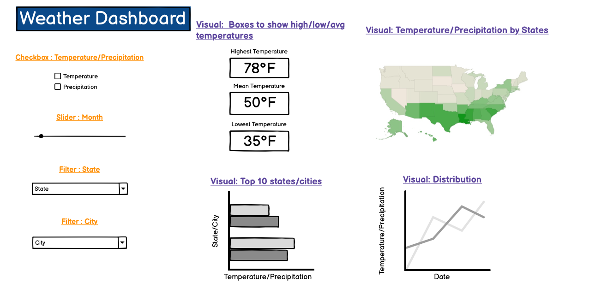

# citytemp 
## Overview

Citytemp dashboard is designed to assist travel enthusiasts in understanding weather fluctuations, temperatures, and precipitation levels across various states/cities in the United States based on historical data to enable them to plan well for their upcoming trips to avoid weather disruptions.
## Description

Our proposed dashboard is designed to present a visual analysis of observed temperature and precipitation data from the [weather_forcasts.csv](https://github.com/rfordatascience/tidytuesday/blob/master/data/2022/2022-12-20/weather_forecasts.csv) in tidytuesday. Specifically, our dashboard is focused on displaying a visual analysis of the two key variables: observed temperature and observed precipitation that are contained within the dataset. The visualizations that we will include are:

1. A map that shows the temperature or precipitation by state. The states will be coloured as a diverging colour palette to identify countries with low, medium, and high levels.
2. A bar chart that shows the top 10 states/cities with the highest temperature/precipitation.
3. A line plot that shows the distribution of temperature/precipitation of a certain states/cities.
4. Boxes showing summary statistics such as highest, lowest and average temperatures of various states/cities.

In addition, our dashboard will offer various filtering options to customize the displayed visualizations and enable the user to manipulate the data as desired.

1. A checkbox that allows users to choose to view either temperature or precipitation data.
2. A slider that allows users to select a single month to visualize.
3. A filter that allows users to select a state to visualize.
4. A filter that allows users to select a city to visualize, if desired.

These options will allow users to identify trends in temperature/precipitation over time in the desired state or city, making it easier to observe how temperature/precipitation and related visualizations have changed across different regions in the United States.

## Dashboard Sketch

## Contributors

* Eyre Hong  
* Renee Kwon
* Sneha Sunil
* Vincent Ho 

Feedback and suggestions are always welcome! Please read [the contributing
guidelines](https://github.com/UBC-MDS/citytemp/blob/main/CONTRIBUTING.md)
to get started.

## Support

If you run into troubles, please [check the issue
list](https://github.com/UBC-MDS/citytemp/issues) to see
if your problem has already been reported or to open new issues.

## Code of conduct

In the interest of fostering an open and welcoming environment, we as contributors and maintainers pledge to making participation in our project and our community a harassment-free experience for everyone, regardless of age, body size, disability, ethnicity, gender identity and expression, level of experience, nationality, personal appearance, race, religion, or sexual identity and orientation. Detailed descriptions
of these points can be found in [`CODE_OF_CONDUCT.md`](https://github.com/UBC-MDS/citytemp/blob/main/CODE_OF_CONDUCT.md).

## License
The citytemp Dashboard was created by Eyre Hong, Renee Kwon, Sneha Sunil, Vincent Ho (UBC MDS). It is licensed under the terms of the MIT license.
